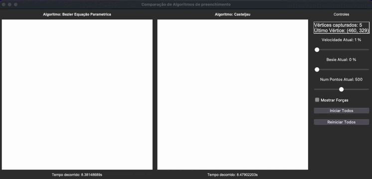

# **Relatório:  Algoritmo de Curvas de Bézier utilizando De Casteljau e Fórmula Paramétrica**

**1. Introdução**

Este relatório descreve e compara dois métodos para gerar curvas de Bézier, com foco na implementação recursiva do método de **De Casteljau** e na **fórmula paramétrica** clássica para cálculo de pontos em uma curva de Bézier. Ambos os métodos são aplicados a um conjunto de pontos de controle e possuem características distintas, que influenciam o desempenho e o resultado final da curva gerada.

**2. Algoritmos Analisados**

1.	**Método de De Casteljau**:

•	Utiliza subdivisões sucessivas para gerar a curva de Bézier de maneira recursiva, dividindo os pontos de controle até que um número suficiente de pontos seja gerado.

2.	**Fórmula Paramétrica de Bézier**:

•	Baseia-se no cálculo direto dos pontos da curva a partir de uma fórmula paramétrica, utilizando um parâmetro t que varia de 0 a 1 para determinar as posições ao longo da curva.

---

**3. Descrição do Funcionamento**

**3.1 Algoritmo de De Casteljau**

O método de **De Casteljau** gera uma curva de Bézier de forma recursiva, realizando subdivisões nos pontos de controle. A cada subdivisão, são calculados os pontos médios entre pares consecutivos de pontos de controle, formando uma nova sequência de pontos. O processo continua até que um número suficiente de pontos seja gerado, os quais definem a curva final.

•	**Processo**:

1.	Começa com uma lista de pontos de controle.

2.	Para cada par de pontos consecutivos, calcula-se o ponto médio.

3.	Recursivamente, o processo é repetido até que a lista de pontos tenha tamanho suficiente para representar a curva.

4.	A curva final é formada por todos os pontos acumulados ao longo da recursão.

**3.2 Algoritmo de Fórmula Paramétrica**

A fórmula paramétrica de Bézier calcula os pontos da curva de forma direta, utilizando um parâmetro t que varia de 0 a 1. A posição na curva é dada pela soma ponderada dos pontos de controle, com coeficientes binomiais que dependem da ordem da curva. O algoritmo gera um ponto para cada valor de t, e a curva é formada pela sequência de pontos gerados.

•	**Processo**:

1.	Para um dado t, calcula-se a posição na curva com base nos pontos de controle e nos coeficientes binomiais.

2.	O cálculo é realizado para t variando de 0 a 1 em pequenos incrementos.

3.	Cada ponto calculado é adicionado à curva, que é formada por todos esses pontos.

---

**4. Diferenças Entre os Algoritmos**

| **Característica** | **De Casteljau** | **Fórmula Paramétrica** |
| --- | --- | --- |
| **Tipo de Algoritmo** | Recursivo, baseado em subdivisão sucessiva. | Cálculo direto de pontos usando fórmula paramétrica. |
| **Memória** | Usa memória recursiva e acumula pontos por subdivisão. | Calcula os pontos diretamente, sem necessidade de armazenamento intermediário. |
| **Precisão** | Alta precisão com um número adequado de subdivisões. | A precisão depende do número de pontos calculados para o valor de t. |
| **Velocidade** | Pode ser mais lento devido à recursão e subdivisões sucessivas. | Geralmente mais rápido, pois o cálculo é direto. |
| **Simplicidade de Implementação** | Requer mais complexidade devido à recursão. | Simples, com base no cálculo direto dos pontos. |

---

**5. Análise de Desempenho**

Ambos os algoritmos são eficientes para desenhar curvas de Bézier, mas têm características distintas que afetam seu desempenho:

•	**De Casteljau**:

•	A recursão e as subdivisões sucessivas podem tornar o algoritmo mais lento, especialmente se um número muito grande de subdivisões for necessário para alcançar a precisão desejada.

•	O uso da recursão pode gerar problemas de memória se o número de pontos de controle for muito grande.

•	**Fórmula Paramétrica**:

•	A fórmula paramétrica tende a ser mais rápida, pois não requer recursão. O desempenho depende apenas do número de pontos t gerados, o que torna o algoritmo mais eficiente para grandes quantidades de pontos de controle.

**Visualização do Desempenho**

A execução simultânea de ambos os algoritmos pode ser visualizada em um ambiente gráfico, onde é possível observar a diferença de desempenho e precisão entre os métodos de De Casteljau e a fórmula paramétrica ao desenharem a mesma curva de Bézier. A velocidade de desenho pode ser ajustada para comparar os tempos de execução de forma mais detalhada.

---

**6. Conclusão**

Ambos os algoritmos, **De Casteljau** e **Fórmula Paramétrica**, são eficazes para gerar curvas de Bézier, mas suas características variam conforme o contexto de uso:

•	**De Casteljau** é ideal quando a curva precisa ser gerada com subdivisões sucessivas, oferecendo alta precisão, mas com um custo de desempenho devido à recursão.

•	**Fórmula Paramétrica** é mais eficiente em termos de velocidade e simplicidade de implementação, mas pode exigir mais pontos de controle para obter resultados de alta precisão.

A escolha entre os dois métodos depende da aplicação específica e das necessidades de desempenho e precisão na geração das curvas.