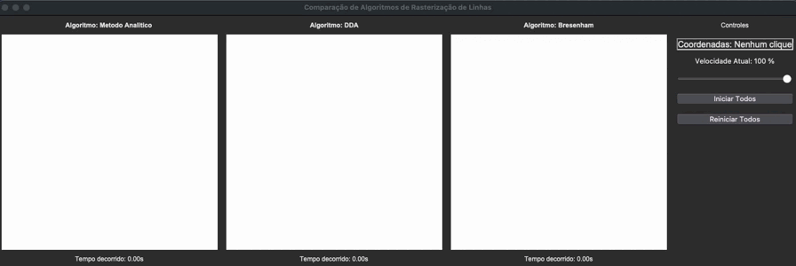
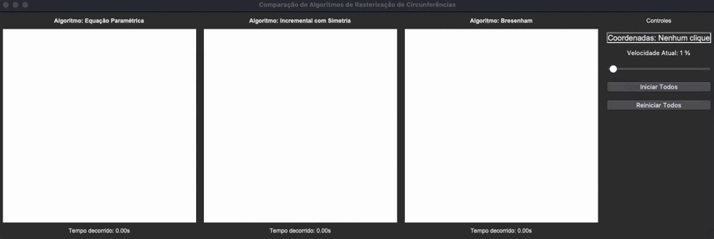
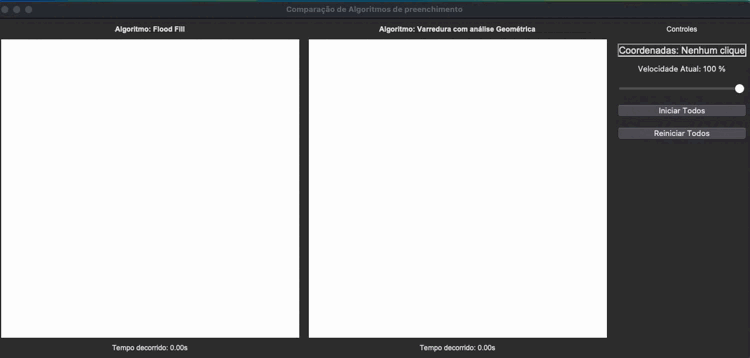

# Projeto: [Algoritmos Gráficos para Desenho e Preenchimento de Formas](#)

Este repositório foi criado como parte de um trabalho para a disciplina de **Computação Gráfica** da **UFRR**. O objetivo principal é proporcionar um meio de aprendizado comparando e demonstrando o funcionamento de distintos algoritmos gráficos clássicos para desenhar e preencher formas geométricas. Cada algoritmo é executado em **threads separadas**, possibilitando uma análise visual e individual de seu desempenho e comportamento.

---

## 📋 Técnicas Implementadas

### [1. Algoritmos de Linhas](Linhas/README.md)
Incluem três métodos clássicos para o desenho de linhas:
- **[Método Analítico](#)**: Utiliza a fórmula da equação da reta para calcular diretamente os pixels.
- **[DDA (Digital Differential Analyzer)](#)**: Realiza interpolação de valores para maior precisão.
- **[Método de Bresenham](#)**: Um dos mais eficientes, utilizando apenas operações inteiras.

A execução simultânea dos algoritmos pode ser visualizada no GIF abaixo:

---

### [2. Algoritmos de Círculos](Circulos/README.md)
Os algoritmos implementados para desenhar círculos são:
- **[Incremental com Simetria](#)**: Baseado na simetria dos 8 octantes para otimizar o cálculo dos pontos.
- **[Equação Paramétrica](#)**: Utiliza funções trigonométricas para controlar o desenho.
- **[Método de Bresenham](#)**: Efetua cálculos incrementais para a aproximação da circunferência ideal.

Confira no GIF abaixo a execução simultânea desses algoritmos:

---

### [3. Algoritmos de Preenchimento de Polígonos](Preenchimento/README.md)
Os métodos de preenchimento implementados incluem:
- **[Flood Fill](#)**: Realiza o preenchimento recursivo de uma área a partir de um ponto interno.
- **[Varredura Geométrica](#)**: Calcula interseções entre arestas e preenche os pixels entre elas de forma sistemática.

Veja o comparativo entre os dois algoritmos no GIF abaixo:

---

## 🎯 Objetivo

Este projeto tem como foco acadêmico demonstrar o funcionamento de algoritmos gráficos e permitir uma análise comparativa. Ele foi desenvolvido de forma a facilitar o entendimento prático dos métodos estudados na disciplina de **Computação Gráfica (UFRR)**.

👀 Para verificar mais detalhes sobre o funcionamento e o **código-fonte**, clique nos títulos das seções acima!