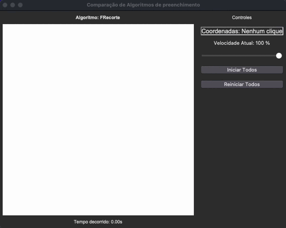

# 1. Introdução

Este relatório analisa o algoritmo de recorte de polígonos **Sutherland-Hodgman**, explicando seu funcionamento e principais características. O algoritmo é amplamente utilizado para recortar polígonos arbitrários contra janelas de recorte convexas, garantindo que apenas a parte do polígono dentro da área visível seja mantida.

### Algoritmo Analisado

1. **Sutherland-Hodgman**: Algoritmo iterativo que processa o polígono um lado de cada vez, mantendo apenas os vértices dentro da região visível.

---

## 2. Descrição do Funcionamento

### 2.1 Algoritmo de **Sutherland-Hodgman**

O algoritmo **Sutherland-Hodgman** realiza o recorte iterativamente, processando cada aresta da janela de recorte contra todos os vértices do polígono. Ele determina quais vértices devem ser mantidos ou descartados com base em sua posição relativa à borda de recorte.

- **Processo**:
    1. Começa com a lista original de vértices do polígono.
    2. Para cada aresta da janela de recorte:
        - Verifica quais vértices estão dentro e fora da região visível.
        - Mantém os vértices dentro.
        - Adiciona pontos de interseção quando um segmento atravessa a borda da janela.
    3. O polígono resultante é o recortado.

---

## 3. Características do Algoritmo

| Característica | **Sutherland-Hodgman** |
| --- | --- |
| **Tipo de Algoritmo** | Iterativo, baseado em teste de interseção |
| **Uso de Memória** | Depende da complexidade do polígono original |
| **Velocidade** | Eficiente para polígonos convexos |
| **Preenchimento de Áreas** | Mantém apenas as partes dentro da janela de recorte |
| **Limitações** | Requer que a janela de recorte seja convexa |

---

## 4. Análise de Desempenho

O algoritmo **Sutherland-Hodgman** é eficiente para polígonos convexos e garante um recorte preciso. Ele utiliza interseções entre os segmentos do polígono e a borda da janela para determinar os novos vértices. A implementação inclui a visualização progressiva do recorte, permitindo acompanhar a transformação do polígono em tempo real.

Foram testados polígonos de diferentes tamanhos dentro de uma janela de recorte 500x500 pixels, analisando o impacto da velocidade e complexidade do recorte.

---

## 5. Conclusão

O algoritmo **Sutherland-Hodgman** é uma solução eficiente para recorte de polígonos contra janelas convexas, garantindo um resultado preciso e um bom desempenho computacional. Sua implementação iterativa reduz problemas de empilhamento de recursão e facilita a visualização do processo de recorte. Apesar de suas vantagens, ele é restrito a janelas convexas, necessitando de adaptações para recortes mais complexos.

